# Confecção TA — Sistema de Gestão para Confecção

---

| Campo       | Informação                          |
|-------------|-------------------------------------|
| **Aluno**   | Lucas Niello                        |
| **Turma**   | 3º DEV - A                          |
| **Escola**  | SENAI — Limeira/SP                  |
| **Disciplina** | Programação BackEnd              |
| **Data**    | Junho de 2026                       |

---

## Sumário

1. [Visão Geral do Sistema](#1-visão-geral-do-sistema)
2. [Requisitos](#2-requisitos)
   - 2.1 [Requisitos Funcionais](#21-requisitos-funcionais)
   - 2.2 [Requisitos Não Funcionais](#22-requisitos-não-funcionais)
3. [Atores e Permissões](#3-atores-e-permissões)
4. [Arquitetura do Sistema](#4-arquitetura-do-sistema)
   - 4.1 [Stack Tecnológica](#41-stack-tecnológica)
   - 4.2 [Padrão MVC](#42-padrão-mvc)
   - 4.3 [Estrutura de Pastas](#43-estrutura-de-pastas)
5. [Modelagem do Banco de Dados](#5-modelagem-do-banco-de-dados)
   - 5.1 [Diagrama ERD](#51-diagrama-erd)
   - 5.2 [Descrição das Tabelas](#52-descrição-das-tabelas)
6. [Rotas do Sistema](#6-rotas-do-sistema)
7. [Módulo de Notificações](#7-módulo-de-notificações)
   - 7.1 [Notificações por E-mail (Mailpit)](#71-notificações-por-e-mail-mailpit)
   - 7.2 [Notificações Internas (Sininho)](#72-notificações-internas-sininho)
8. [Manual de Instalação](#8-manual-de-instalação)
9. [Credenciais de Acesso (Seed Padrão)](#9-credenciais-de-acesso-seed-padrão)
10. [Cenários de Teste](#10-cenários-de-teste)
11. [Decisões de Projeto](#11-decisões-de-projeto)
12. [Glossário](#12-glossário)
13. [Fluxogramas e Diagramas](#13-fluxogramas-e-diagramas)
    - 13.1 [Diagrama de Casos de Uso](#131-diagrama-de-casos-de-uso)
    - 13.2 [Fluxograma de Autenticação](#132-fluxograma-de-autenticação)
    - 13.3 [Ciclo de Vida do Pedido](#133-ciclo-de-vida-do-pedido)
    - 13.4 [Fluxograma de Criação de Pedido](#134-fluxograma-de-criação-de-pedido)
    - 13.5 [Fluxograma de Alteração de Status do Pedido](#135-fluxograma-de-alteração-de-status-do-pedido)
    - 13.6 [Fluxograma de Movimentação de Estoque](#136-fluxograma-de-movimentação-de-estoque)
    - 13.7 [Fluxograma de Cadastro de Funcionário](#137-fluxograma-de-cadastro-de-funcionário)
    - 13.8 [Diagrama de Sequência — Criação de Pedido](#138-diagrama-de-sequência--criação-de-pedido)
    - 13.9 [Diagrama de Sequência — Estoque Baixo e Notificação](#139-diagrama-de-sequência--estoque-baixo-e-notificação)
    - 13.10 [Diagrama de Arquitetura MVC](#1310-diagrama-de-arquitetura-mvc)

---

## 1. Visão Geral do Sistema

O **Confecção TA** é um sistema web de gestão interna desenvolvido para empresas do segmento de confecção têxtil. O sistema centraliza o controle de funcionários, clientes, fornecedores, produtos, estoque e pedidos em uma única plataforma, eliminando a dependência de planilhas e processos manuais que costumam gerar inconsistências, retrabalho e perda de informações.

O sistema resolve problemas típicos do dia a dia de uma confecção: saber quantas peças ainda há em estoque antes de aceitar um pedido, registrar entradas e saídas de materiais com rastreabilidade, acompanhar o ciclo de vida de cada pedido desde a abertura até a conclusão, e garantir que o cliente receba notificações automáticas a cada mudança de status.

Este projeto é um **protótipo funcional de caráter acadêmico**, construído como trabalho avaliativo da disciplina de Programação BackEnd no SENAI Limeira. O escopo foi definido para demonstrar o domínio das tecnologias e conceitos estudados — autenticação, CRUD completo, relacionamentos entre entidades, envio de e-mails, notificações internas e painel com indicadores — sem a pretensão de cobrir todos os requisitos de um sistema de produção real.

---

## 2. Requisitos

### 2.1 Requisitos Funcionais

| Código | Descrição |
|--------|-----------|
| RF01 | O sistema deve permitir que usuários autenticados façam login com e-mail e senha. |
| RF02 | O sistema deve permitir que o usuário autenticado faça logout. |
| RF03 | O administrador deve poder criar, visualizar, editar e excluir usuários do sistema (admin ou funcionário). |
| RF04 | O administrador deve poder criar, visualizar, editar e excluir cargos, com nome, descrição e salário-base. |
| RF05 | O administrador deve poder cadastrar, visualizar, editar e excluir funcionários, vinculando-os a um cargo e a um usuário do sistema. |
| RF06 | Ao cadastrar um funcionário, o sistema deve enviar automaticamente um e-mail de boas-vindas para o endereço cadastrado. |
| RF07 | O sistema deve permitir criar, visualizar, editar e excluir clientes, com nome, CPF/CNPJ, e-mail, telefone e endereço. |
| RF08 | O sistema deve permitir criar, visualizar, editar e excluir fornecedores, com razão social, CNPJ, e-mail, telefone e tipo de material. |
| RF09 | O sistema deve permitir criar, visualizar, editar e excluir categorias de produtos. |
| RF10 | O sistema deve permitir criar, visualizar, editar e excluir produtos, associando-os a uma categoria e, opcionalmente, a um fornecedor. |
| RF11 | O sistema deve manter um registro de estoque para cada produto, com quantidade atual e quantidade mínima. |
| RF12 | O sistema deve permitir registrar movimentações de estoque (entrada ou saída), com produto, quantidade e motivo. |
| RF13 | Ao registrar uma saída que reduza o estoque abaixo da quantidade mínima, o sistema deve emitir uma notificação interna para todos os administradores ativos. |
| RF14 | O sistema deve permitir criar pedidos vinculando um cliente, um ou mais itens (produto + quantidade + preço) e observações opcionais. |
| RF15 | O sistema deve calcular automaticamente o subtotal de cada item e o total do pedido. |
| RF16 | Ao criar um pedido, o sistema deve enviar automaticamente um e-mail de confirmação para o cliente. |
| RF17 | O sistema deve permitir atualizar o status de um pedido (pendente → em produção → concluído / cancelado). |
| RF18 | Ao alterar o status de um pedido, o sistema deve enviar automaticamente um e-mail de atualização para o cliente. |
| RF19 | O sistema deve exibir um painel (dashboard) com indicadores: total de funcionários ativos, total de clientes, pedidos em aberto, produtos com estoque baixo, gráfico de pedidos por status e os 5 últimos pedidos. |
| RF20 | O usuário deve poder visualizar e marcar como lidas as notificações internas pelo ícone de sininho no menu. |

### 2.2 Requisitos Não Funcionais

| Código | Descrição |
|--------|-----------|
| RNF01 | **Usabilidade:** A interface deve ser responsiva e intuitiva, utilizando Tailwind CSS para garantir uma experiência adequada em diferentes tamanhos de tela. |
| RNF02 | **Desempenho:** As listagens devem usar paginação (10 registros por página nas listas principais, 15 no histórico de movimentações) para evitar carregamento excessivo de dados. |
| RNF03 | **Segurança:** Todas as rotas da aplicação devem exigir autenticação via middleware `auth`. Senhas são armazenadas com hash bcrypt. |
| RNF04 | **Manutenibilidade:** O projeto deve seguir o padrão MVC do Laravel com FormRequests para validação, mantendo controllers enxutos e de fácil leitura. |
| RNF05 | **Portabilidade:** O sistema deve funcionar no ambiente Laragon (Windows) com PHP 8.3, MySQL e Node.js instalados. |
| RNF06 | **Compatibilidade:** O sistema deve funcionar nos navegadores modernos (Chrome, Edge, Firefox) em suas versões atuais. |
| RNF07 | **Rastreabilidade:** Todas as movimentações de estoque registram o usuário responsável, permitindo auditoria do histórico. |
| RNF08 | **Integridade dos dados:** Chaves estrangeiras com restrições adequadas (`restrictOnDelete`, `cascadeOnDelete`, `nullOnDelete`) garantem consistência referencial no banco de dados. |

---

## 3. Atores e Permissões

O sistema possui dois perfis de acesso: **Administrador** e **Funcionário**. O controle de acesso é realizado diretamente nas views e controllers com a verificação `auth()->user()->perfil === 'admin'`.

| Módulo | Admin | Funcionário |
|--------|:-----:|:-----------:|
| Dashboard | Acesso completo | Acesso completo |
| Usuários (CRUD) | Sim | Não |
| Cargos (CRUD) | Sim | Não |
| Funcionários (CRUD) | Sim | Não |
| Clientes (CRUD) | Sim | Sim |
| Fornecedores (CRUD) | Sim | Sim |
| Categorias (CRUD) | Sim | Sim |
| Produtos (CRUD) | Sim | Sim |
| Estoque (visualizar) | Sim | Sim |
| Movimentações de Estoque (registrar) | Sim | Sim |
| Pedidos (CRUD) | Sim | Sim |
| Notificações internas | Recebe e visualiza | Não recebe |
| Perfil pessoal (editar) | Sim | Sim |

**Administrador:** tem acesso irrestrito a todos os módulos do sistema, incluindo o gerenciamento de usuários, cargos e funcionários. É o único perfil que recebe notificações internas de estoque baixo. Pode criar, editar e excluir qualquer registro do sistema.

**Funcionário:** tem acesso aos módulos operacionais do dia a dia — clientes, fornecedores, categorias, produtos, estoque e pedidos — mas não acessa as configurações internas do sistema (usuários, cargos e cadastro de funcionários). Não recebe notificações de estoque baixo. Pode editar o próprio perfil de acesso (nome, e-mail, senha).

---

## 4. Arquitetura do Sistema

### 4.1 Stack Tecnológica

**Backend**

| Tecnologia | Versão |
|------------|--------|
| PHP | ^8.3 |
| Laravel Framework | ^13.8 |
| Laravel Breeze (autenticação) | ^2.4 |
| Laravel Tinker | ^3.0 |
| Laravel Pint (code style) | ^1.27 |
| PHPUnit | ^12.5 |
| Faker | ^1.23 |

**Frontend**

| Tecnologia | Versão |
|------------|--------|
| Vite | ^8.0 |
| Tailwind CSS | ^3.1 |
| Alpine.js | ^3.4.2 |
| @tailwindcss/forms | ^0.5.2 |
| laravel-vite-plugin | ^3.1 |

**Banco de Dados**

- MySQL (via Laragon em desenvolvimento)
- Migrações gerenciadas pelo Eloquent Schema Builder

**Ferramentas de Desenvolvimento**

- Mailpit (captura de e-mails locais)
- Laragon (ambiente web Windows)
- Laravel Pail (log em tempo real)

### 4.2 Padrão MVC

O projeto aplica o padrão **Model-View-Controller** conforme a convenção do Laravel:

**Models (app/Models/)**

Cada entidade do domínio é representada por um Model Eloquent. Os models definem os campos preenchíveis via `$fillable`, conversões de tipo via `$casts`, e os relacionamentos entre entidades (`belongsTo`, `hasOne`, `hasMany`). O model `MovimentacaoEstoque` utiliza o método estático `booted()` para registrar um hook que atualiza automaticamente o saldo do estoque e dispara notificações sempre que uma movimentação é criada — lógica de domínio colocada na camada correta, sem poluir o controller.

**Controllers (app/Http/Controllers/)**

Todos os módulos utilizam Resource Controllers, que mapeiam os métodos HTTP padrão (`index`, `create`, `store`, `show`, `edit`, `update`, `destroy`) às operações CRUD. A validação dos dados de entrada é delegada a FormRequests (`app/Http/Requests/`), com mensagens de erro em português. Os controllers se mantêm enxutos: recebem a requisição validada, executam a lógica de negócio (incluindo transações de banco onde necessário) e redirecionam com mensagem de feedback.

**Views (resources/views/)**

As views utilizam o motor de templates **Blade** do Laravel. O layout principal é compartilhado via herança de template (`@extends` / `@section`). Interações dinâmicas na interface — como adicionar e remover itens de um pedido sem recarregar a página — são implementadas com **Alpine.js**, declarado diretamente nos atributos HTML (`x-data`, `x-for`, `@click`). A estilização é feita inteiramente com classes utilitárias do **Tailwind CSS**.

### 4.3 Estrutura de Pastas

```
confeccao2.0_TA/
├── app/
│   ├── Http/
│   │   ├── Controllers/        # Resource controllers de cada módulo
│   │   └── Requests/           # FormRequests com validações em PT-BR
│   ├── Mail/                   # Mailables (e-mails transacionais)
│   ├── Models/                 # Models Eloquent com relacionamentos
│   └── Notifications/          # Notificações internas (banco de dados)
├── database/
│   ├── migrations/             # Migrações das tabelas do sistema
│   └── seeders/                # Seeds com dados de exemplo
├── docs/
│   └── DOCUMENTACAO.md         # Este arquivo
├── resources/
│   ├── css/                    # Estilos base (Tailwind)
│   ├── js/                     # Entrypoint do Alpine.js e Vite
│   └── views/
│       ├── auth/               # Views de login (Breeze)
│       ├── cargos/             # CRUD de cargos
│       ├── categorias/         # CRUD de categorias
│       ├── clientes/           # CRUD de clientes
│       ├── dashboard/          # Painel principal com indicadores
│       ├── emails/             # Templates HTML dos e-mails
│       ├── estoque/            # Listagem e detalhes de estoque
│       ├── fornecedores/       # CRUD de fornecedores
│       ├── funcionarios/       # CRUD de funcionários
│       ├── layouts/            # Layout principal da aplicação
│       ├── movimentacoes/      # Registro e histórico de movimentações
│       ├── notificacoes/       # Central de notificações internas
│       ├── pedidos/            # CRUD de pedidos com itens
│       ├── profile/            # Edição do perfil do usuário (Breeze)
│       └── usuarios/           # CRUD de usuários
├── routes/
│   ├── auth.php                # Rotas de autenticação (Breeze)
│   └── web.php                 # Rotas da aplicação
├── .env                        # Configurações do ambiente local
├── .env.example                # Template de configuração
├── composer.json               # Dependências PHP
└── package.json                # Dependências JavaScript
```

---

## 5. Modelagem do Banco de Dados

### 5.1 Diagrama ERD

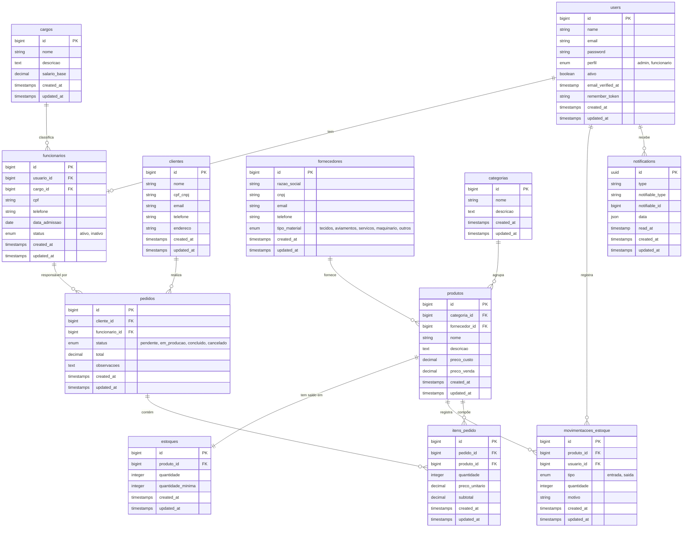

### 5.2 Descrição das Tabelas

**users** — Usuários do sistema com acesso ao painel. Campos adicionais `perfil` e `ativo` foram incluídos via migration adicional sobre a tabela padrão do Laravel.

| Campo | Tipo | Descrição |
|-------|------|-----------|
| id | bigint (PK) | Identificador único |
| name | string | Nome completo |
| email | string (unique) | E-mail de acesso |
| password | string | Senha com hash bcrypt |
| perfil | enum | `admin` ou `funcionario` |
| ativo | boolean | Se o usuário pode fazer login |

---

**cargos** — Cargos ocupacionais que podem ser atribuídos a funcionários.

| Campo | Tipo | Descrição |
|-------|------|-----------|
| id | bigint (PK) | Identificador único |
| nome | string | Nome do cargo |
| descricao | text (nullable) | Descrição das atribuições |
| salario_base | decimal(10,2) | Salário-base do cargo |

---

**funcionarios** — Dados profissionais dos funcionários, vinculados a um usuário e a um cargo.

| Campo | Tipo | Descrição |
|-------|------|-----------|
| id | bigint (PK) | Identificador único |
| usuario_id | bigint (FK) | Referência a `users` (cascade delete) |
| cargo_id | bigint (FK) | Referência a `cargos` (restrict delete) |
| cpf | string(14) (unique) | CPF do funcionário |
| telefone | string(20) | Telefone de contato |
| data_admissao | date | Data de início |
| status | enum | `ativo` ou `inativo` |

---

**clientes** — Clientes cadastrados que podem ter pedidos associados.

| Campo | Tipo | Descrição |
|-------|------|-----------|
| id | bigint (PK) | Identificador único |
| nome | string | Nome ou razão social |
| cpf_cnpj | string(20) (unique) | Documento do cliente |
| email | string | E-mail para notificações |
| telefone | string(20) | Telefone de contato |
| endereco | string | Endereço completo |

---

**fornecedores** — Empresas que fornecem materiais ou serviços para a confecção.

| Campo | Tipo | Descrição |
|-------|------|-----------|
| id | bigint (PK) | Identificador único |
| razao_social | string | Nome legal da empresa |
| cnpj | string(18) (unique) | CNPJ da empresa |
| email | string | E-mail de contato |
| telefone | string(20) | Telefone de contato |
| tipo_material | enum | `tecidos`, `aviamentos`, `servicos`, `maquinario` ou `outros` |

---

**categorias** — Categorias para organizar os produtos do catálogo.

| Campo | Tipo | Descrição |
|-------|------|-----------|
| id | bigint (PK) | Identificador único |
| nome | string | Nome da categoria |
| descricao | text (nullable) | Descrição da categoria |

---

**produtos** — Produtos do catálogo da confecção, com preços e vínculos de categoria e fornecedor.

| Campo | Tipo | Descrição |
|-------|------|-----------|
| id | bigint (PK) | Identificador único |
| categoria_id | bigint (FK) | Referência a `categorias` (restrict delete) |
| fornecedor_id | bigint (FK, nullable) | Referência a `fornecedores` (null on delete) |
| nome | string | Nome do produto |
| descricao | text (nullable) | Descrição do produto |
| preco_custo | decimal(10,2) | Preço de custo |
| preco_venda | decimal(10,2) | Preço de venda |

---

**estoques** — Saldo atual e quantidade mínima de cada produto. Relação 1:1 com produtos.

| Campo | Tipo | Descrição |
|-------|------|-----------|
| id | bigint (PK) | Identificador único |
| produto_id | bigint (FK, unique) | Referência a `produtos` (cascade delete) |
| quantidade | integer | Saldo atual em unidades |
| quantidade_minima | integer | Limite mínimo de alerta (padrão: 5) |

---

**movimentacoes_estoque** — Histórico de todas as entradas e saídas de estoque.

| Campo | Tipo | Descrição |
|-------|------|-----------|
| id | bigint (PK) | Identificador único |
| produto_id | bigint (FK) | Referência a `produtos` (cascade delete) |
| usuario_id | bigint (FK) | Referência a `users` (restrict delete) |
| tipo | enum | `entrada` ou `saida` |
| quantidade | integer | Quantidade movimentada |
| motivo | string | Justificativa da movimentação |

---

**pedidos** — Pedidos realizados por clientes e gerenciados pelo sistema.

| Campo | Tipo | Descrição |
|-------|------|-----------|
| id | bigint (PK) | Identificador único |
| cliente_id | bigint (FK) | Referência a `clientes` (restrict delete) |
| funcionario_id | bigint (FK, nullable) | Referência a `funcionarios` (null on delete) |
| status | enum | `pendente`, `em_producao`, `concluido` ou `cancelado` |
| total | decimal(10,2) | Valor total do pedido |
| observacoes | text (nullable) | Observações adicionais |

---

**itens_pedido** — Itens que compõem cada pedido (produto, quantidade e preço no momento do pedido).

| Campo | Tipo | Descrição |
|-------|------|-----------|
| id | bigint (PK) | Identificador único |
| pedido_id | bigint (FK) | Referência a `pedidos` (cascade delete) |
| produto_id | bigint (FK) | Referência a `produtos` (restrict delete) |
| quantidade | integer | Quantidade do item |
| preco_unitario | decimal(10,2) | Preço unitário no momento do pedido |
| subtotal | decimal(10,2) | quantidade × preco_unitario |

---

**notifications** — Tabela nativa do Laravel para notificações internas via banco de dados.

| Campo | Tipo | Descrição |
|-------|------|-----------|
| id | uuid (PK) | Identificador único |
| type | string | Classe da notificação |
| notifiable_type | string | Tipo do destinatário (ex: `App\Models\User`) |
| notifiable_id | bigint | ID do destinatário |
| data | json | Payload da notificação |
| read_at | timestamp (nullable) | Data/hora em que foi lida (null = não lida) |

---

## 6. Rotas do Sistema

Todas as rotas estão protegidas pelo middleware `auth`. As rotas de autenticação (login, logout, registro, recuperação de senha) são gerenciadas pelo Laravel Breeze em `routes/auth.php`.

| Método | URI | Controller@método | Nome | Perfil |
|--------|-----|-------------------|------|--------|
| GET | `/` | Redirect para dashboard | — | Qualquer |
| GET | `/dashboard` | `DashboardController@index` | `dashboard` | Qualquer |
| GET | `/profile` | `ProfileController@edit` | `profile.edit` | Qualquer |
| PATCH | `/profile` | `ProfileController@update` | `profile.update` | Qualquer |
| DELETE | `/profile` | `ProfileController@destroy` | `profile.destroy` | Qualquer |
| GET | `/usuarios` | `UsuarioController@index` | `usuarios.index` | Admin |
| GET | `/usuarios/create` | `UsuarioController@create` | `usuarios.create` | Admin |
| POST | `/usuarios` | `UsuarioController@store` | `usuarios.store` | Admin |
| GET | `/usuarios/{usuario}` | `UsuarioController@show` | `usuarios.show` | Admin |
| GET | `/usuarios/{usuario}/edit` | `UsuarioController@edit` | `usuarios.edit` | Admin |
| PATCH | `/usuarios/{usuario}` | `UsuarioController@update` | `usuarios.update` | Admin |
| DELETE | `/usuarios/{usuario}` | `UsuarioController@destroy` | `usuarios.destroy` | Admin |
| GET | `/cargos` | `CargoController@index` | `cargos.index` | Admin |
| GET | `/cargos/create` | `CargoController@create` | `cargos.create` | Admin |
| POST | `/cargos` | `CargoController@store` | `cargos.store` | Admin |
| GET | `/cargos/{cargo}` | `CargoController@show` | `cargos.show` | Admin |
| GET | `/cargos/{cargo}/edit` | `CargoController@edit` | `cargos.edit` | Admin |
| PATCH | `/cargos/{cargo}` | `CargoController@update` | `cargos.update` | Admin |
| DELETE | `/cargos/{cargo}` | `CargoController@destroy` | `cargos.destroy` | Admin |
| GET | `/funcionarios` | `FuncionarioController@index` | `funcionarios.index` | Admin |
| GET | `/funcionarios/create` | `FuncionarioController@create` | `funcionarios.create` | Admin |
| POST | `/funcionarios` | `FuncionarioController@store` | `funcionarios.store` | Admin |
| GET | `/funcionarios/{funcionario}` | `FuncionarioController@show` | `funcionarios.show` | Admin |
| GET | `/funcionarios/{funcionario}/edit` | `FuncionarioController@edit` | `funcionarios.edit` | Admin |
| PATCH | `/funcionarios/{funcionario}` | `FuncionarioController@update` | `funcionarios.update` | Admin |
| DELETE | `/funcionarios/{funcionario}` | `FuncionarioController@destroy` | `funcionarios.destroy` | Admin |
| GET | `/clientes` | `ClienteController@index` | `clientes.index` | Qualquer |
| GET | `/clientes/create` | `ClienteController@create` | `clientes.create` | Qualquer |
| POST | `/clientes` | `ClienteController@store` | `clientes.store` | Qualquer |
| GET | `/clientes/{cliente}` | `ClienteController@show` | `clientes.show` | Qualquer |
| GET | `/clientes/{cliente}/edit` | `ClienteController@edit` | `clientes.edit` | Qualquer |
| PATCH | `/clientes/{cliente}` | `ClienteController@update` | `clientes.update` | Qualquer |
| DELETE | `/clientes/{cliente}` | `ClienteController@destroy` | `clientes.destroy` | Qualquer |
| GET | `/fornecedores` | `FornecedorController@index` | `fornecedores.index` | Qualquer |
| GET | `/fornecedores/create` | `FornecedorController@create` | `fornecedores.create` | Qualquer |
| POST | `/fornecedores` | `FornecedorController@store` | `fornecedores.store` | Qualquer |
| GET | `/fornecedores/{fornecedor}` | `FornecedorController@show` | `fornecedores.show` | Qualquer |
| GET | `/fornecedores/{fornecedor}/edit` | `FornecedorController@edit` | `fornecedores.edit` | Qualquer |
| PATCH | `/fornecedores/{fornecedor}` | `FornecedorController@update` | `fornecedores.update` | Qualquer |
| DELETE | `/fornecedores/{fornecedor}` | `FornecedorController@destroy` | `fornecedores.destroy` | Qualquer |
| GET | `/categorias` | `CategoriaController@index` | `categorias.index` | Qualquer |
| GET | `/categorias/create` | `CategoriaController@create` | `categorias.create` | Qualquer |
| POST | `/categorias` | `CategoriaController@store` | `categorias.store` | Qualquer |
| GET | `/categorias/{categoria}` | `CategoriaController@show` | `categorias.show` | Qualquer |
| GET | `/categorias/{categoria}/edit` | `CategoriaController@edit` | `categorias.edit` | Qualquer |
| PATCH | `/categorias/{categoria}` | `CategoriaController@update` | `categorias.update` | Qualquer |
| DELETE | `/categorias/{categoria}` | `CategoriaController@destroy` | `categorias.destroy` | Qualquer |
| GET | `/produtos` | `ProdutoController@index` | `produtos.index` | Qualquer |
| GET | `/produtos/create` | `ProdutoController@create` | `produtos.create` | Qualquer |
| POST | `/produtos` | `ProdutoController@store` | `produtos.store` | Qualquer |
| GET | `/produtos/{produto}` | `ProdutoController@show` | `produtos.show` | Qualquer |
| GET | `/produtos/{produto}/edit` | `ProdutoController@edit` | `produtos.edit` | Qualquer |
| PATCH | `/produtos/{produto}` | `ProdutoController@update` | `produtos.update` | Qualquer |
| DELETE | `/produtos/{produto}` | `ProdutoController@destroy` | `produtos.destroy` | Qualquer |
| GET | `/estoque` | `EstoqueController@index` | `estoque.index` | Qualquer |
| GET | `/estoque/{estoque}` | `EstoqueController@show` | `estoque.show` | Qualquer |
| GET | `/movimentacoes` | `MovimentacaoEstoqueController@index` | `movimentacoes.index` | Qualquer |
| GET | `/movimentacoes/create` | `MovimentacaoEstoqueController@create` | `movimentacoes.create` | Qualquer |
| POST | `/movimentacoes` | `MovimentacaoEstoqueController@store` | `movimentacoes.store` | Qualquer |
| GET | `/pedidos` | `PedidoController@index` | `pedidos.index` | Qualquer |
| GET | `/pedidos/create` | `PedidoController@create` | `pedidos.create` | Qualquer |
| POST | `/pedidos` | `PedidoController@store` | `pedidos.store` | Qualquer |
| GET | `/pedidos/{pedido}` | `PedidoController@show` | `pedidos.show` | Qualquer |
| GET | `/pedidos/{pedido}/edit` | `PedidoController@edit` | `pedidos.edit` | Qualquer |
| PATCH | `/pedidos/{pedido}` | `PedidoController@update` | `pedidos.update` | Qualquer |
| DELETE | `/pedidos/{pedido}` | `PedidoController@destroy` | `pedidos.destroy` | Qualquer |
| GET | `/notificacoes` | `NotificacaoController@index` | `notificacoes.index` | Qualquer |
| POST | `/notificacoes/marcar-lidas` | `NotificacaoController@marcarLidas` | `notificacoes.marcar-lidas` | Qualquer |

---

## 7. Módulo de Notificações

### 7.1 Notificações por E-mail (Mailpit)

O sistema usa **Mailpit** como servidor SMTP local para desenvolvimento. Todos os e-mails enviados pela aplicação são interceptados pelo Mailpit e podem ser visualizados em seu painel web, sem serem entregues a endereços reais.

**Configuração no `.env` (ambiente de desenvolvimento):**

```env
MAIL_MAILER=smtp
MAIL_HOST=127.0.0.1
MAIL_PORT=1025
MAIL_USERNAME=null
MAIL_PASSWORD=null
MAIL_FROM_ADDRESS="noreply@confeccao.com"
MAIL_FROM_NAME="Confecção TA"
```

**Como acessar o painel:** Abra `http://localhost:8025` no navegador com o Mailpit em execução.

**Eventos que disparam e-mail:**

| Evento | Classe | Assunto |
|--------|--------|---------|
| Criação de pedido | `PedidoCriadoMail` | `Pedido #N recebido — Confecção TA` |
| Alteração de status do pedido | `StatusPedidoAlteradoMail` | `Atualização do Pedido #N — Confecção TA` |
| Cadastro de funcionário | `FuncionarioCadastradoMail` | `Bem-vindo ao sistema — Confecção TA` |

**Como testar:**

1. Inicie o Mailpit: execute `mailpit` no terminal (ou via Laragon).
2. No sistema, crie um pedido para um cliente que tenha e-mail cadastrado.
3. Acesse `http://localhost:8025` — o e-mail de confirmação do pedido estará na caixa de entrada.
4. Edite o pedido e altere o status — um novo e-mail de atualização será entregue.

### 7.2 Notificações Internas (Sininho)

As notificações internas utilizam o sistema nativo do Laravel Database Notifications, armazenando os registros na tabela `notifications`.

**Como funciona:** Ao criar uma movimentação de estoque do tipo **saída**, o modelo `MovimentacaoEstoque` executa um hook `booted()` que atualiza o saldo na tabela `estoques`. Se o novo saldo for menor ou igual à `quantidade_minima`, o sistema busca todos os usuários com `perfil = admin` e `ativo = true`, e para cada um dispara a notificação `EstoqueBaixoNotification`.

**O que a notificação contém:** Produto com estoque crítico, quantidade atual e quantidade mínima configurada.

**Como visualizar:** O ícone de sininho no menu superior exibe um contador com o número de notificações não lidas. Ao clicar, o usuário é levado à central de notificações (`/notificacoes`) com todas as notificações em ordem cronológica inversa.

**Como marcar como lida:** Na central de notificações, o botão "Marcar todas como lidas" envia um `POST /notificacoes/marcar-lidas`, que executa `unreadNotifications->markAsRead()` e preenche o campo `read_at` de todas as notificações pendentes do usuário autenticado.

---

## 8. Manual de Instalação

### Pré-requisitos

- **Laragon** (inclui PHP 8.3, MySQL e Apache) — [laragon.org](https://laragon.org)
- **Git** — [git-scm.com](https://git-scm.com)
- **Node.js** v18 ou superior — [nodejs.org](https://nodejs.org)
- **Mailpit** (opcional, para testar e-mails) — [github.com/axllent/mailpit](https://github.com/axllent/mailpit/releases)
- **Composer** — incluído no Laragon ou [getcomposer.org](https://getcomposer.org)

### Passo a Passo

**1. Clonar o repositório**

```bash
git clone https://github.com/LucasNiello/confeccao2.0_TA.git
cd confeccao2.0_TA
```

**2. Instalar dependências PHP**

```bash
composer install
```

**3. Instalar dependências JavaScript**

```bash
npm install
```

**4. Configurar o arquivo de ambiente**

Copie o arquivo de exemplo e ajuste as variáveis:

```bash
cp .env.example .env
php artisan key:generate
```

Edite o `.env` com as configurações do seu ambiente local:

```env
APP_NAME="Confecção TA"
APP_ENV=local
APP_DEBUG=true
APP_URL=http://localhost:8000

# Banco de dados (MySQL via Laragon)
DB_CONNECTION=mysql
DB_HOST=127.0.0.1
DB_PORT=3306
DB_DATABASE=confeccao_ta
DB_USERNAME=root
DB_PASSWORD=

# E-mail (Mailpit local)
MAIL_MAILER=smtp
MAIL_HOST=127.0.0.1
MAIL_PORT=1025
MAIL_USERNAME=null
MAIL_PASSWORD=null
MAIL_FROM_ADDRESS="noreply@confeccao.com"
MAIL_FROM_NAME="Confecção TA"
```

**5. Criar o banco de dados**

Abra o **HeidiSQL** (incluso no Laragon) ou execute no MySQL:

```sql
CREATE DATABASE confeccao_ta CHARACTER SET utf8mb4 COLLATE utf8mb4_unicode_ci;
```

**6. Executar migrations e seeds**

```bash
php artisan migrate --seed
```

Isso criará todas as tabelas e populará o banco com dados de exemplo (usuários, cargos, funcionários, clientes, fornecedores, categorias, produtos, estoque e pedidos).

**7. Compilar os assets frontend**

```bash
npm run build
```

**8. Iniciar o Mailpit (opcional)**

```bash
mailpit
```

O painel estará disponível em `http://localhost:8025`.

**9. Iniciar o servidor de desenvolvimento**

```bash
php artisan serve
```

Acesse `http://localhost:8000` no navegador.

---

## 9. Credenciais de Acesso (Seed Padrão dos Logins e Senhas de teste)

Após executar `php artisan migrate --seed`, os seguintes usuários estarão disponíveis:

| Perfil | Nome | E-mail | Senha |
|--------|------|--------|-------|
| Admin | Administrador | `admin@confeccao.com` | `password` |
| Funcionário | Ana Paula Ferreira | `ana.ferreira@confeccao.com` | `password` |
| Funcionário | Carlos Eduardo Lima | `carlos.lima@confeccao.com` | `password` |
| Funcionário | Mariana Santos | `mariana.santos@confeccao.com` | `password` |
| Funcionário | Ricardo Oliveira | `ricardo.oliveira@confeccao.com` | `password` |
| Funcionário | Fernanda Costa | `fernanda.costa@confeccao.com` | `password` |

> **Atenção:** As credenciais acima são exclusivas para ambiente de desenvolvimento e demonstração. Em ambiente de produção, as senhas devem ser fortes e individualizadas (Criptografado no Banco de dados).
---

## 10. Cenários de Teste

### CT01 — Login com credenciais válidas

**Pré-condição:** Sistema rodando, seed executado.

**Passos:**
1. Acesse `http://localhost:8000/login`.
2. Informe o e-mail `admin@confeccao.com` e a senha `password`.
3. Clique em "Entrar".

**Resultado esperado:** Redirecionamento para o dashboard com o nome do usuário exibido no menu.

---

### CT02 — Login com credenciais inválidas

**Pré-condição:** Sistema rodando.

**Passos:**
1. Acesse `http://localhost:8000/login`.
2. Informe o e-mail `admin@confeccao.com` e a senha `senhaerrada`.
3. Clique em "Entrar".

**Resultado esperado:** A página de login é reexibida com a mensagem de erro "As credenciais fornecidas não correspondem aos nossos registros." (mensagem padrão do Breeze em PT-BR).

---

### CT03 — Criar um pedido com itens

**Pré-condição:** Usuário autenticado, ao menos um cliente e um produto cadastrados (seed já garante isso).

**Passos:**
1. Acesse "Pedidos" no menu lateral.
2. Clique em "Novo Pedido".
3. Selecione um cliente no dropdown.
4. Clique em "Adicionar Item", selecione um produto e informe a quantidade.
5. Adicione mais um item, se desejar.
6. Preencha o campo "Observações" (opcional).
7. Clique em "Criar Pedido".

**Resultado esperado:**
- Redirecionamento para a listagem de pedidos com mensagem de sucesso.
- O pedido aparece na lista com status "Pendente".
- Se o cliente possui e-mail cadastrado, um e-mail de confirmação é enviado e aparece no Mailpit (`http://localhost:8025`).

---

### CT04 — Alterar status de um pedido e verificar e-mail

**Pré-condição:** Pedido existente com status "Pendente", Mailpit em execução.

**Passos:**
1. Na listagem de pedidos, clique no pedido desejado para ver os detalhes.
2. Clique em "Editar".
3. Altere o campo "Status" para "Em Produção".
4. Clique em "Salvar".
5. Acesse `http://localhost:8025`.

**Resultado esperado:**
- Redirecionamento para os detalhes do pedido com mensagem de sucesso.
- O status do pedido exibe "Em Produção" com a cor azul correspondente.
- No Mailpit, um novo e-mail com assunto `Atualização do Pedido #N — Confecção TA` foi recebido para o e-mail do cliente.

---

### CT05 — Cadastrar um funcionário e verificar e-mail de boas-vindas

**Pré-condição:** Usuário autenticado como admin, ao menos um cargo cadastrado (seed garante isso), Mailpit em execução.

**Passos:**
1. Acesse "Funcionários" no menu lateral.
2. Clique em "Novo Funcionário".
3. Preencha todos os campos: nome, e-mail, senha, CPF, telefone, data de admissão, cargo e status.
4. Clique em "Cadastrar".
5. Acesse `http://localhost:8025`.

**Resultado esperado:**
- Redirecionamento para a listagem de funcionários com mensagem de sucesso.
- O funcionário aparece na lista.
- No Mailpit, um e-mail com assunto `Bem-vindo ao sistema — Confecção TA` foi enviado para o endereço cadastrado.

---

### CT06 — Registrar saída de estoque abaixo do mínimo e verificar sininho

**Pré-condição:** Usuário autenticado como admin. Identifique um produto cujo estoque atual seja próximo da quantidade mínima (verifique em "Estoque").

**Passos:**
1. Acesse "Movimentações" no menu lateral.
2. Clique em "Nova Movimentação".
3. Selecione o produto identificado, escolha tipo "Saída" e informe uma quantidade que faça o saldo cair abaixo ou igual à quantidade mínima.
4. Informe o motivo e clique em "Registrar".
5. Observe o ícone de sininho no menu superior.

**Resultado esperado:**
- Redirecionamento para o estoque com mensagem de sucesso.
- O ícone de sininho exibe um contador vermelho com o número de notificações não lidas.
- Ao clicar no sininho e acessar a central de notificações, o alerta de estoque baixo do produto aparece listado.

---

## 11. Decisões de Projeto

### 1. Model `User` mantido sem renomeação

O Laravel Breeze, os guards de autenticação, a tabela `users` e o sistema de notificações nativas do framework referenciam a classe `User` por convenção. Renomear para `Usuario` exigiria sobrescrever configurações do guard, ajustar o `AuthServiceProvider`, e ainda poderia gerar conflitos com macros internas do Breeze. A solução adotada foi manter o model `User` intacto e adicionar os campos `perfil` e `ativo` por meio de uma migration adicional (`add_perfil_ativo_to_users_table`), preservando a compatibilidade total com o framework.

### 2. Clientes sem acesso ao sistema (sem login)

O escopo do sistema é a gestão interna da confecção, operada por funcionários e administradores. Criar um terceiro fluxo de autenticação para clientes adicionaria um guard separado, novas rotas, views de login próprias e lógica de controle de acesso mais complexa — tudo isso sem agregar valor demonstrável dentro do escopo acadêmico. O cliente é, portanto, uma entidade de cadastro puro: existe no banco, recebe e-mails automáticos, mas não opera o sistema.

### 3. Envio de e-mails síncrono (sem queues)

O envio de e-mails é feito com `Mail::to()->send()` de forma síncrona. Em produção, o ideal seria usar filas (`Mail::queue()`) para não bloquear a resposta ao usuário enquanto o SMTP processa. Porém, filas exigem um worker rodando em background (`php artisan queue:work`), o que aumenta a complexidade do ambiente de demonstração. Para o contexto de apresentação do projeto, o envio síncrono é imperceptível ao usuário e suficiente para demonstrar a funcionalidade.

### 4. Notificações de estoque sem WebSocket

O contador de notificações no sininho é atualizado a cada carregamento de página, consultando o banco de dados. Uma solução em tempo real exigiria Laravel Reverb ou Pusher com WebSockets, o que adicionaria um servidor de broadcasting, chaves de API e configuração de canal. Para o escopo acadêmico, a atualização por page load é funcional e demonstra o conceito de notificações sem aumentar a complexidade de infraestrutura.

### 5. Controle de perfil sem pacote externo (sem Spatie Permissions)

O sistema possui exatamente dois perfis: `admin` e `funcionario`. O controle de acesso é realizado diretamente com verificações `@if(auth()->user()->perfil === 'admin')` nas views e no método `isAdmin()` do model `User`. Adotar o pacote Spatie Laravel Permission traria tabelas extras, facades adicionais e uma curva de aprendizado que não se justifica para dois perfis fixos. A solução nativa é mais simples, mais legível e mais fácil de explicar em uma apresentação acadêmica.

---

## 12. Glossário

| Termo | Definição |
|-------|-----------|
| **Confecção** | Empresa que fabrica roupas e artigos têxteis, gerenciando materiais, produção e vendas. |
| **Insumo** | Material utilizado no processo de fabricação de peças (tecidos, linhas, botões, zíperes). |
| **Aviamento** | Materiais de acabamento utilizados na confecção, como botões, elásticos, etiquetas e zíperes. |
| **Movimentação de Estoque** | Registro de entrada (compra/devolução) ou saída (venda/uso em produção) de um produto no estoque. |
| **Quantidade Mínima** | Saldo de estoque abaixo do qual o sistema emite um alerta, indicando necessidade de reposição. |
| **Pedido** | Solicitação formalizada de compra feita por um cliente, composta por um ou mais itens. |
| **Item de Pedido** | Linha de um pedido que representa um produto específico com quantidade e preço acordados. |
| **Fornecedor** | Empresa que fornece materiais, máquinas ou serviços para a confecção. |
| **Cargo** | Função ou posição ocupacional de um funcionário dentro da empresa (ex: costureira, cortador). |
| **Status do Pedido** | Estado atual de um pedido no seu ciclo de vida: `pendente`, `em_producao`, `concluido` ou `cancelado`. |
| **Seed** | Conjunto de dados de exemplo inseridos automaticamente no banco de dados para facilitar testes e demonstrações. |
| **Migration** | Script versionado que define a estrutura das tabelas do banco de dados, executado via `php artisan migrate`. |
| **Mailpit** | Servidor SMTP local para desenvolvimento que captura e-mails enviados pela aplicação sem entregá-los a destinatários reais. |
| **Notificação Interna** | Alerta exibido dentro do sistema (sininho), armazenado no banco de dados via Laravel Database Notifications. |
| **Dashboard** | Painel principal do sistema com indicadores resumidos e gráficos para visão geral da operação. |
| **CRUD** | Acrônimo para as quatro operações básicas em sistemas: Create (criar), Read (ler), Update (atualizar) e Delete (excluir). |
| **MVC** | Padrão de arquitetura de software que separa a aplicação em Model (dados), View (interface) e Controller (lógica). |
| **Middleware** | Camada de software que intercepta requisições HTTP antes que cheguem ao controller, usada para autenticação e autorização. |
| **FormRequest** | Classe do Laravel que encapsula as regras de validação de um formulário, mantendo o controller limpo. |
| **Eloquent ORM** | Mapeador objeto-relacional do Laravel que permite interagir com o banco de dados usando objetos PHP. |

---

## 13. Fluxogramas e Diagramas

### 13.1 Diagrama de Casos de Uso

Representa os dois atores do sistema e as funcionalidades disponíveis para cada um.

```mermaid
graph TD
    Admin(["👤 Administrador"])
    Func(["👤 Funcionário"])

    subgraph Sistema ["Sistema — Confecção TA"]
        UC01["Login / Logout"]
        UC02["Editar Perfil Pessoal"]
        UC03["Visualizar Dashboard"]
        UC04["Gerenciar Usuários"]
        UC05["Gerenciar Cargos"]
        UC06["Gerenciar Funcionários"]
        UC07["Gerenciar Clientes"]
        UC08["Gerenciar Fornecedores"]
        UC09["Gerenciar Categorias"]
        UC10["Gerenciar Produtos"]
        UC11["Visualizar Estoque"]
        UC12["Registrar Movimentação de Estoque"]
        UC13["Gerenciar Pedidos"]
        UC14["Receber Notificações de Estoque Baixo"]
    end

    Admin --- UC01
    Admin --- UC02
    Admin --- UC03
    Admin --- UC04
    Admin --- UC05
    Admin --- UC06
    Admin --- UC07
    Admin --- UC08
    Admin --- UC09
    Admin --- UC10
    Admin --- UC11
    Admin --- UC12
    Admin --- UC13
    Admin --- UC14

    Func --- UC01
    Func --- UC02
    Func --- UC03
    Func --- UC07
    Func --- UC08
    Func --- UC09
    Func --- UC10
    Func --- UC11
    Func --- UC12
    Func --- UC13
```

---

### 13.2 Fluxograma de Autenticação

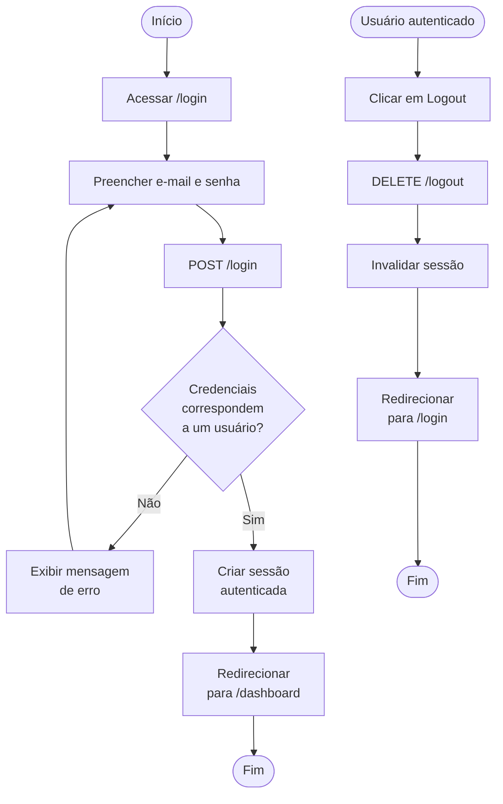

---

### 13.3 Ciclo de Vida do Pedido

Representa os estados possíveis de um pedido e as transições permitidas entre eles.

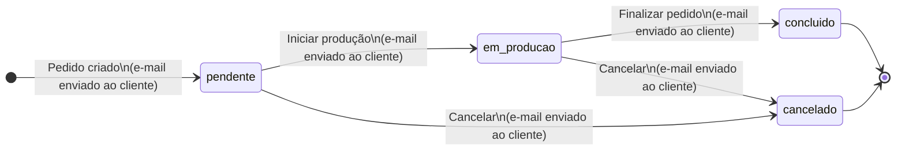

---

### 13.4 Fluxograma de Criação de Pedido

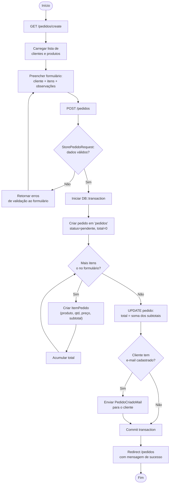

---

### 13.5 Fluxograma de Alteração de Status do Pedido

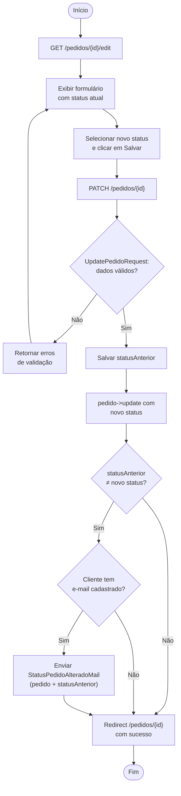

---

### 13.6 Fluxograma de Movimentação de Estoque

Inclui o mecanismo automático de notificação disparado pelo evento `booted()` do model.

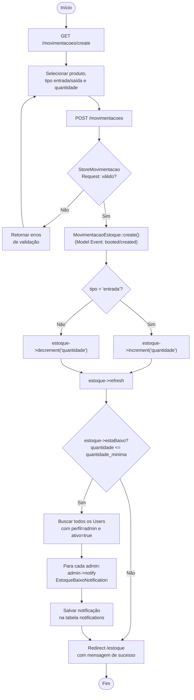

---

### 13.7 Fluxograma de Cadastro de Funcionário

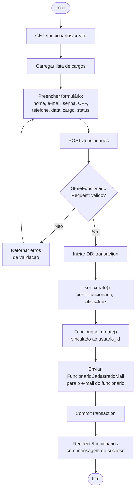

---

### 13.8 Diagrama de Sequência — Criação de Pedido

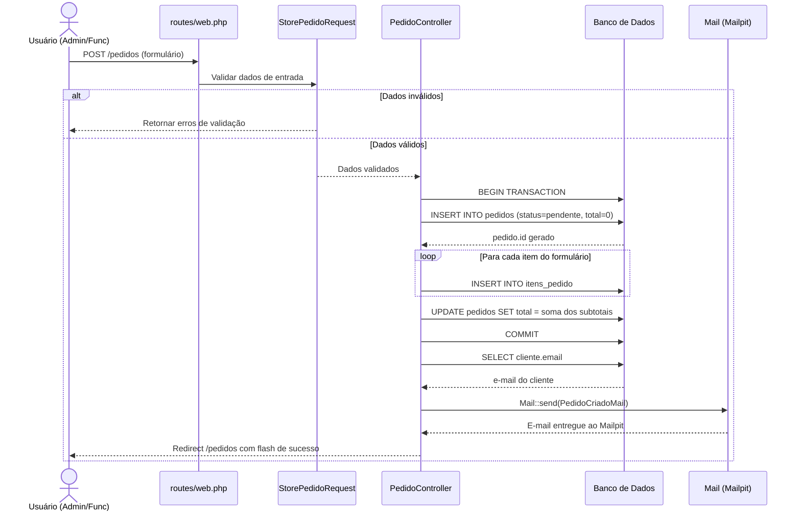

---

### 13.9 Diagrama de Sequência — Estoque Baixo e Notificação

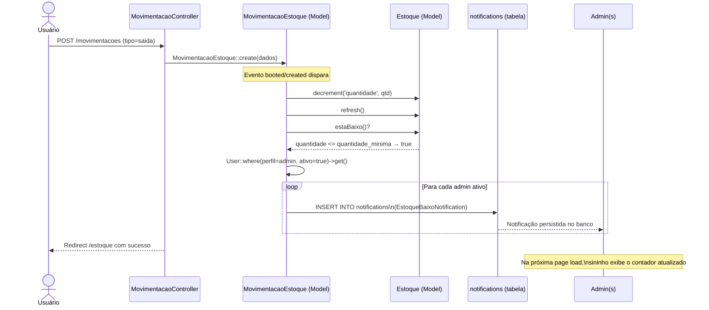

---

### 13.10 Diagrama de Arquitetura MVC

Mostra como as camadas do padrão MVC se comunicam no projeto, do navegador ao banco de dados.

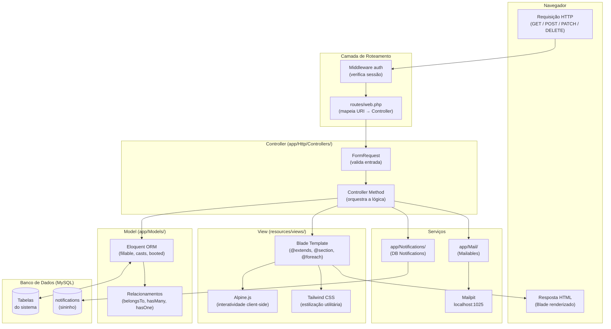
